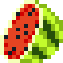

# Fruit Ninja - init2025 edition

- [Abivahendid](#abivahendid)
- [Sissejuhatus](#sissejuhatus)
- [Ülesanded](#%C3%BClesanded)
    - [🐍 PyGame paigaldamine](#-pygame-paigaldamine)
    - [🍉 Puuviljade loomine](#-puuviljade-loomine)
    - [✂️ Puuviljade lõikamine](#-puuviljade-l%C3%B5ikamine)
    - [💥 Pommi lisamine](#-pommide-lisamine)
    - [🔢 Skoori arvutamine](#-skoori-arvutamine)
    - [🔊 Heliefektide lisamine](#-heliefektide-lisamine)
    - [⭐ Boonusülesanded](#-boonus%C3%BClesanded)

## Abivahendid

Kõige olulisem abivahend selles töötoas on **oskus küsida küsimusi**. Küsimusi soovitame julgelt küsida klassis ringi
liikuvate **abiõppejõudude käest**, kes on valmis vastama kõikidele küsimustele. Kui abiõppejõud ei oska aidata, võid
kasutada ka [**Dr. Google'it**](https://google.ee), [PyGame dokumentatsiooni](https://www.pygame.org/docs/) või meie
projekti kaustas [`solutions`](https://github.com/taltech-coding/init-pygame-2025/tree/main/solutions) olevaid
lahendusi. Tunnis kasutatud slaidiesitlust saab järele
vaadata [siit](https://docs.google.com/presentation/d/1Tx6Us4cHqSNCZh6fkEnREpzOUHxgPIb2akcuWgAFb8Q/edit)!

## Sissejuhatus

Oled praktikant ja sinu ülesandeks on anda viimane lihv tulevasele AAAA mängule **"Fruit Ninja - init2025 edition"**!

Aga oh ei - osa koodi on kogemata kaduma läinud, sest üks töötaja unustas muudatused salvestamata! Õnneks on alles
varasemad arendaja juhised dokumentatsioonis, mis aitavad sul mängu taastada ja õigeks ajaks Steami üles laadida!

Mäng on loodud [PyGame](https://www.pygame.org/docs/) abil.

## Ülesanded

Oleme sulle ette valmistanud ülesanded ning juhtnöörid nende lahendamiseks. Kui vajad abi, tõsta julgelt käsi või kasuta
Dr. Google'it! Peamine eesmärk on **õppida ja lõbutseda!** 🎮

### 🐍 PyGame paigaldamine

Enne koodi kirjutamist peame PyGame paigaldama. Avame kooditöötlusprogrammi (nt PyCharm), laadime alla projekti koodi ja
avame terminali (`>_`). Seejärel käivitame käsu:

```sh
pip install pygame
```

Kui tekib probleeme, küsi julgelt abi!

### 🍉 Puuviljade loomine

1. **Puuviljad peaksid ilmuma juhuslikult ekraani alumisse serva.**
   Mine faili `fruit_ninja.py` ja otsi sealt üles funktsioon `spawn_fruit()`.

   Kui `spawn_fruit()` funktsioon käivitatakse, määratakse igale uuele puuviljale tüüp, alguspunkt ja trajektoor.

    - Puuvilja tüüp valitakse juhuslikult sõnastikust `fruit_images`, kasutades selleks funktsiooni `random.choice()`.
    - Alguspunkt `x` määratakse vahemikus `150` kuni `SCREEN_WIDTH - 150`, et need ei ilmuks liiga lähedale servadele.
      `y` koordinaat seatakse alati väärtusele `SCREEN_HEIGHT`, et puuviljad ilmuksid ekraani allservas.
    - Liikumise trajektoor koosneb horisontaalsest kiirusest, mille väärtus võib olla `-2` või `2`, ning vertikaalsest
      kiirusest, mis jääb vahemikku `-20` kuni `-18`.

   Kui see funktsioon välja kutsutakse, siis tuleks luua uus `Fruit` objekt. Sellele objektile peab argumentidena
   kaasa andma eelnevalt välja arvutatud `fruit_type`, `x`, `y` ja `trajectory` väärtused. Lõpuks tuleb vastloodud
   Fruit objekt lisada `self.fruits` nimekirja.

    <details>
    <summary>💡 Kuidas luua uusi muutujaid ja objekte Pythonis?</summary>

```py

# Loome muutuja 'fruit_type' ja määrame selle väärtuseks "apple".
fruit_type = "apple"
x = 200  # määrame koordinaadi x-teljele
y = 600  # määrame koordinaadi y-teljele
trajectory = (-2, -19)  # määrame liikumise trajektoori

# Loome 'Fruit' objekti, kasutades eelnevalt määratud muutujaid.
new_fruit = Fruit(fruit_type, x, y, trajectory)

# Lisame objekti nimekirja, et seda saaks mängus kasutada.
fruits.append(new_fruit)
```

</details>

### 🍏 Puuviljade liikumine

1. **Puuviljade liikumise arvutamine**

   Puuviljad peaksid lendama üles, ja seejärel taas gravitatsiooni mõjul alla kukkuma!

   Kõigepealt mine faili `constants.py` ja defineeri gravitatsioonikonstant.

   Loo muutuja (konstant) `GRAVITY` ja anna sellele väärtuseks `0.3`, et simuleerida raskusjõudu. Võid muidugi seda
   väärtust timmida, et mängu huvitavamaks muuta. 😉

   Nüüd otsi üles fail `fruit.py`. Selles failis on kirjas kogu puuviljadega seonduv loogika. Hakkame muutma puuvilja
   koordinaate, kasutades selleks varem mainitud trajektoori väärtusi.

   Iga kaader kutsutakse välja `def move()` funktsiooni. Sinna alla pead kirjutama puuvilja liikumise koodi!

   Esimene trajektoorielement (`self.trajectory[0]`) näitab puuvilja liikumise kiirust X-telje suhtes. Seega tuleks
   igal kaadril liita `self.x`-ile (puuvilja X-koordinaadile) `self.trajectory[0]` (puuvilja kiirust X-telje suhtes).
   Teine trajektoorielement (`self.trajectory[1]`) näitab järelikult puuvilja liikumise kiirust Y-telje suhtes, ning
   tema väärtus tuleks igal kaadril liita `self.y`-ile (puuvilja Y-koordinaadile).

   Proovi pärast nende muudatuste tegemist mängu käima panna! Ava PyCharmis fail `fruit_ninja.py`, vajuta ▶️ play
   nupule, ning näed, et mängu alustades lendavad nüüd ringi puuviljad!

   Aga nagu tähelepanelik uudistaja kindlasti märkab, siis puuviljad lendavad ekraanil ainult ülespoole. Et seda viga
   parandada, kasutame varem loodud gravitatsioonikonstanti, et uuendada trajektoori. Muudame igal kaadril trajektoori
   väärtust nii, et jätame esimese väärtuse (`self.trajectory[0]`) samaks, kuid liidame teisele väärtusele
   (`self.trajectory[1]`) otsa `GRAVITY`. Uue trajektoori salvestamiseks saame kasutada koodirida
   `self.trajectory = (esimene väärtus, teine väärtus)`.

    <details>
    <summary>💡 Kuidas luua, liita ja lahutada muutujaid Python-is?</summary>
   
    ```py
    # Loome muutuja 'x', ning seame selle väärtuseks 0.
    x = 1
    x += 5  # muutujale viie liitmine
            # x on nüüd 1 + 5 = 6
    x -= 2  # muutujast kahe lahutamine
            # x on nüüd 6 - 2 = 4
    # saad ka liita mõne muu muutuja võrra
    teine_muutuja = 5
    x += teine_muutuja
    # x on nüüd 4 + teine_muutuja = 4 + 5 = 9
    ```
    </details>


2. **Puuviljade keerlemise arvutamine**

   Puuviljad peaksid mängus visuaalselt pöörlema. Selleks tuleb igal kaadril nende pöördenurka uuendada.

   Mine taaskord faili `fruit.py`, ning leia sealt funktsioon `def move()`, kus toimub puuviljade liikumise määramine.

   Kuna seda funktsiooni kutsutakse välja igal kaadril, siis puuvilja pöörlema panemiseks piisab sellest, kui siinkohal
   `self.angle` väärtusele (puuvilja praegune pöördenurk) liita juurde `self.rotate_direction` (samas failis veidi
   ülevalpool defineeritud muutuja, mis määrab suvaliselt puuvilja pöörlemise suuna ja kiiruse).

### 🍉 Skoori arvutamine

Kui puuvili on pooleks lõigatud, siis peaksime mängijale lisama juurde ühe punkti.

Mine faili `fruit_ninja.py` ja otsi üles `def handle_slicing()` funktsioon, mis vastutab puuviljade lõikamise loogika
eest.

Kui puuvili on pooleks lõigatud, siis lisa `self.score` väärtusele +1, et arvestada iga lõigatud puuvilja eest mängijale
punkt.

Kui tahad oma mängu huvitavamaks muuta, siis võid siinkohal kasutada ka mingit teistsugust skoorinumbrit!

### 💥 Pommi lõikamine

Kui mängija lõikab pommi, siis kaotab mängija kõik oma elud ja mäng tuleb kohe lõpetada.

Mine uuesti faili `fruit_ninja.py` ja otsi taaskord üles `def handle_slicing()` funktsioon, kus pesitseb puuviljade ja
pommide lõikamise loogika.

Kui lõigatud objekt on pomm, siis:

1. Seadke mängija elud (`self.lives`) nulli.
2. Määrake mängu oleku (`self.state`) väärtuseks `STATE_GAME_OVER`, et näidata, et mäng on läbi.
3. Tühjendage puuviljade nimekiri (`self.fruits`), et ei oleks võimalik pärast mängu lõppu enam mängija skoori
   suurendada.

### 💔 Kaotusseisu tuvastamine

Praegu oleme määranud, et mäng lõppeb, kui mängija elud saavad otsa või kui lõigatakse pooleks pomm. Pommi
poolekslõikamisega tegelesime me eelmises punktis, ent hetkeseisuga pole meil veel süsteemi, mis automaatselt
kontrolliks, kas mängija elud on nulli jõudnud, ning seejärel mäng lõpetada.

Endiselt toimetame failis `fruit_ninja.py`. Seekord otsi üles `def update()` funktsioon.
Kui elud (`self.lives`) saavad nulli (või jäävad alla nulli, võimalike bugide vältimiseks), siis:

- Määrake mängu oleku (`self.state`) väärtuseks `STATE_GAME_OVER`, et mäng oleks lõppenud.
- Tühjendage puuviljade nimekiri (`self.fruits`), et kõik puuviljad kaoksid ekraanilt.

### 🏆 Parima skoori salvestamine

Kui mängija saavutab uue parima skoori, siis tuleb see salvestada faili, et järgmine kord mängu käivitades viimane
parim skoor kaduma ei läheks.

Ja taaskord muudame faili `fruit_ninja.py`. Otsi sealt üles funktsioon `def save_highscore()`. Siin tuleb teha järgmist:

1. Avage fail `"highscore.txt"` kirjutamisrežiimis. Selle kohta võib rohkem lugeda näiteks [PyDocist](https://pydoc.pages.taltech.ee/input_output/write_to_file/writing-into-existing-file.html).
2. Kirjutage praegune parim skoor (`self.highscore`) faili. Enne kirjutamist tuleb see konverteerida `str()` meetodi,
   abil sõneks (string), kuna faili kirjutamine nõuab sõne andmetüüpi.

### 🔊 Heliefektide lisamine

Et mängu huvitavamaks muuta, saame lisada erinevaid heliefekte, nagu taustamuusika, pommide lõhkemine ja puuviljade
poolekslõikamine. Esiteks peame sisse laadima helifailid, et saaksime neid mängu jooksul mängida.

Ava fail `resources.py`, ning lisa sinna muutujad kõigi soovitud helide jaoks. Abiks vaata, kuidas on loodud muutuja
`flute_sound`. Kõik meie poolt loodud helifailid võid leida kaustast `"assets/sounds"`, ning kui soovid kasutada hoopis
enda helifaile, siis paiguta need sinnasamasse kausta!

Failis `resources.py` võiks sisse laadida järgmised helid:

1. Menüü taustamuusika (`soundtrack`);
2. Mängu taustamuusika (`ambience`);
3. Pommi viskamine (`bomb_throw`);
4. Tavaline puuvilja viskamine (`fruit_throw`);
5. Pommi lõhkemine (`explosion_sound`);
6. Puuvilja lõikamine (`fruit_slice`);
7. Puuvilja kaotamine (`miss_sound`).

Seejärel mine faili `fruit_ninja.py` ja lisa need heliefektid õigesse kohta, kus need peaksid mängima. Paljud sobivad
kohad oleme me sinu jaoks juba üles otsinud, ning need on koodis märgitud kommentaariga
`# TODO: Play the ... sound here!`.

Et heliefekti mängida, pead kutsuma vastava heliefekti muutuja alt välja `.play()` meetodi.

Näiteks, et mängida `flute_sound`-i, kirjutasime me mängukoodi, et kui mängija alustab uut mängu, siis ...
```py
flute_sound.play()
```

Taustamuusika võiks jääda end pärast laulu lõppemist kordama. Selleks saame `.play()` meetodile anda kaasa parameetri,
mis ütleb talle, mitu korda see lugu end kordama peaks. Kui soovime, et lugu jääks end lõpmatult kordama, siis tuleks
selle parameetri väärtuseks panna `-1`.
```py
soundtrack.play(-1)
```

### ⭐ Boonusülesanded
- 👑 Tee nii, et skoori suurenedes läheks mäng kiiremaks või raskemaks.
- 👑 Lisa mängu uue taustaga level
- 👑 Vaheta välja mõni heliefekt
- 👑 Lisa uusi puuvilju
- 👑 Lisa visuaalseid efekte (näiteks puuviljadele "pooleks minemise" animatsioon või pommile plahvatamise animatsioon)